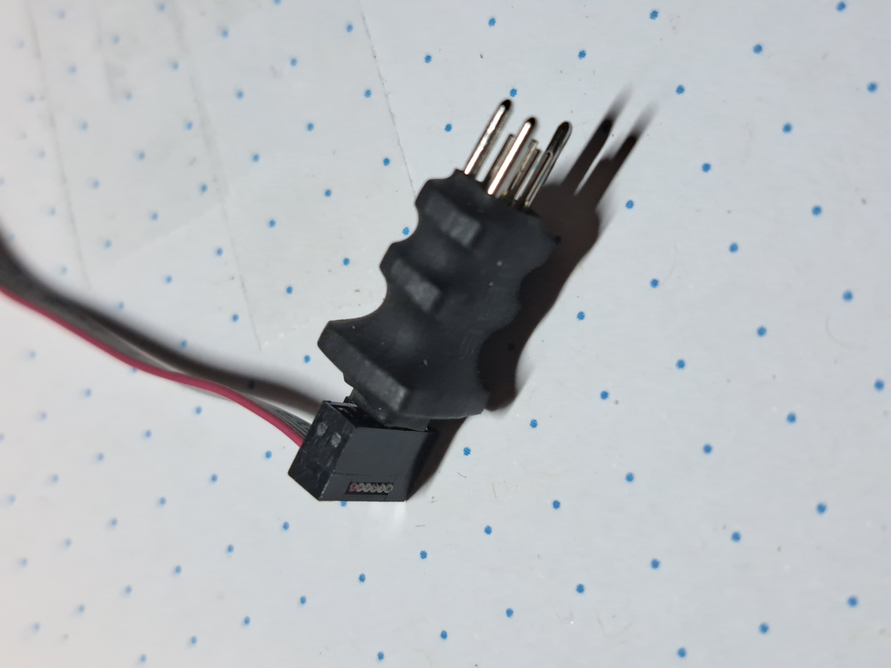
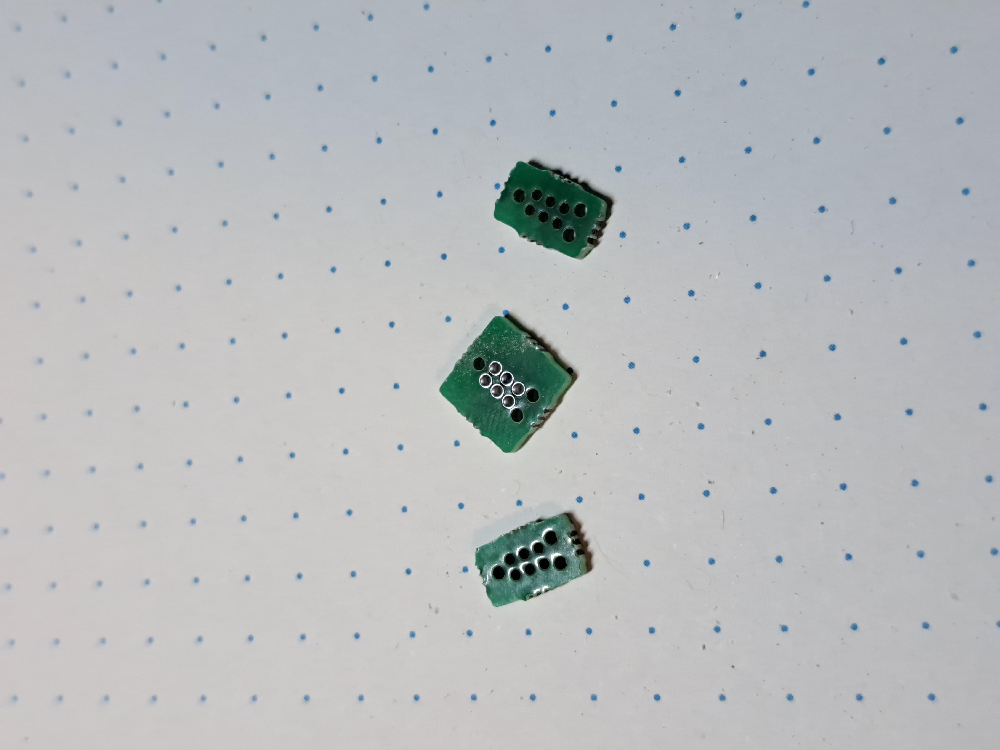
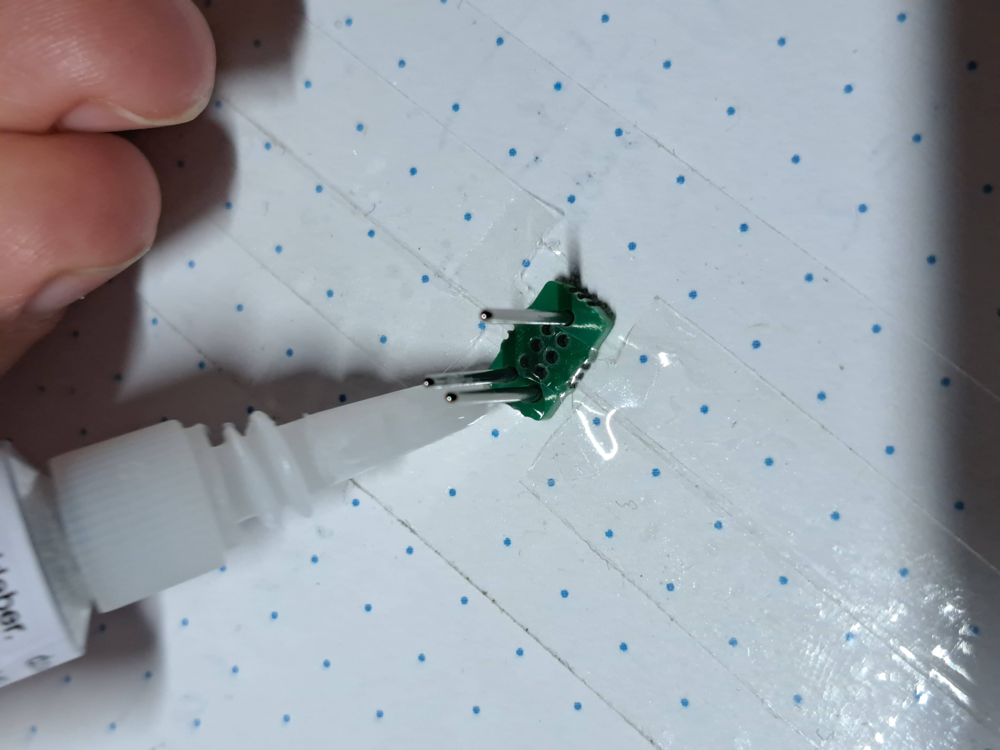
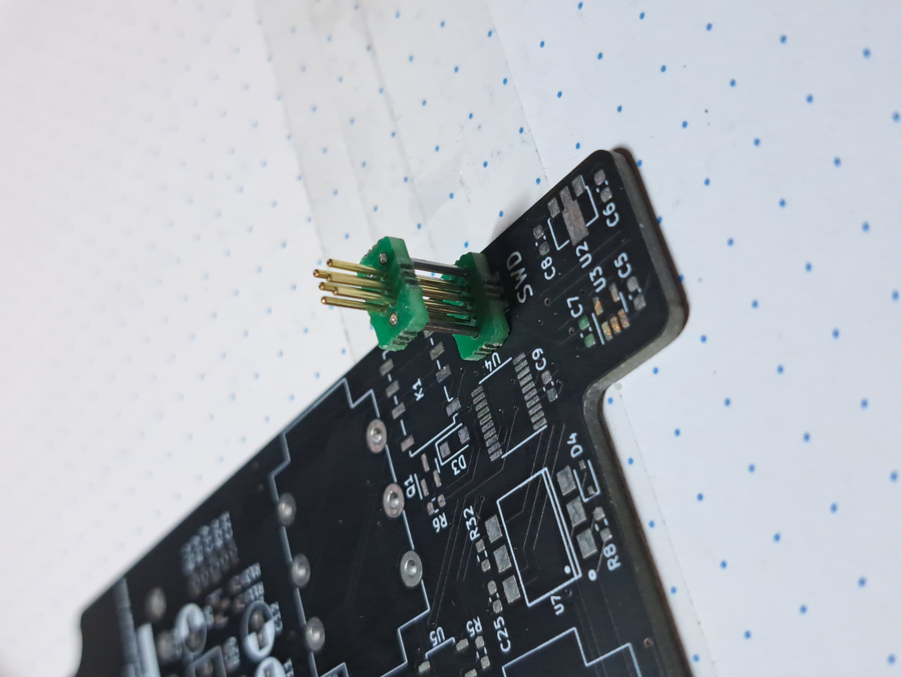
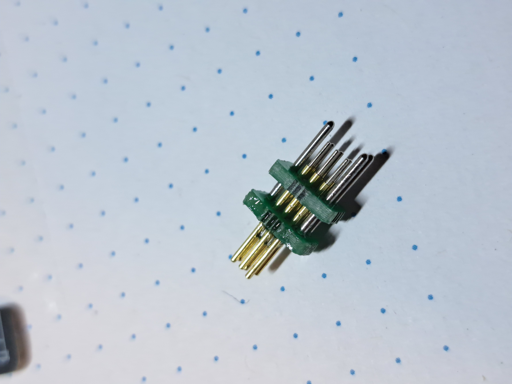
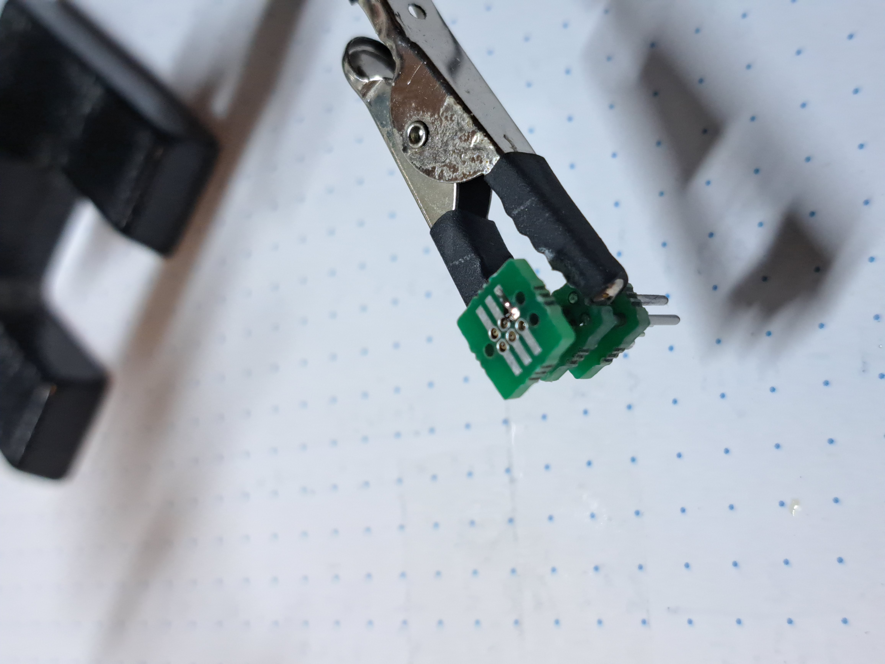
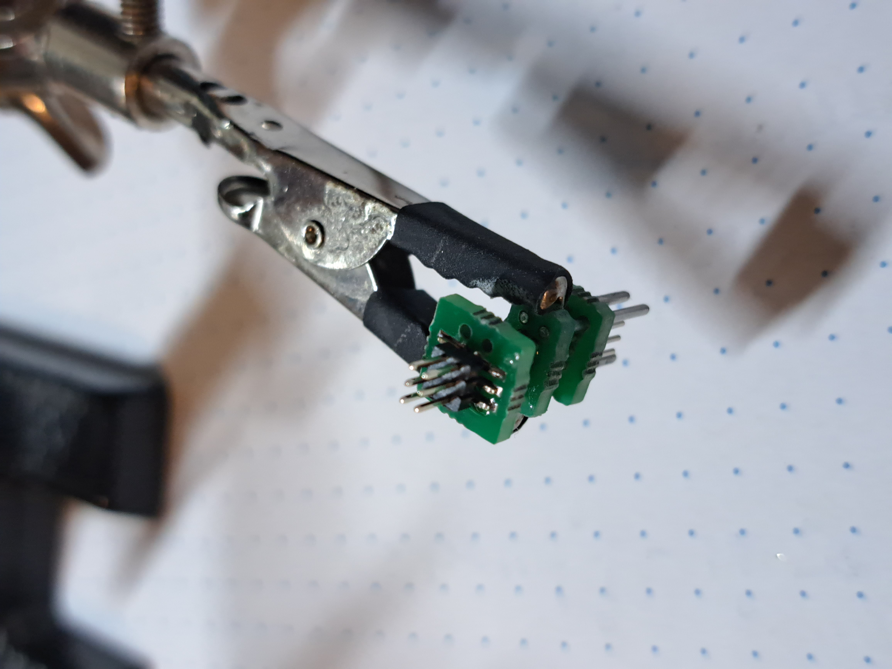

## PogoProbe

## Description
A TC2030-compatible pogo pin debug/programming probe.

## Materials:
1. 1x PogoProbe PCB
2. 6x P50-J1 Pogo Pins
3. 3x M0.9 x 20mm steel guiding rod
4. 1x P1.27mm 2x03 SMD Header
5. Super Glue and a PCB with a TC2030 footprint

## Assembly Instructions:

1.  Separate the PCBs from the panel.

2.  Add the guiding pins and glue them with a drop of superglue. Be careful not to pour any superglue into the other 6 holes. I used tape to cover the pogo pin holes.

3.  Using a PCB that has the TC2030 footprint, insert the assembly into the guiding holes. Now insert the 6 pogo pins until they sit on the PCB. Glue them to the PCB with superglue.

4.  Glue the second PCB on the front side of the probe. I tried going for a 5mm offset from the end of the guiding pins.

5.  Add the bottom PCB and fix it in place by soldering one of the pins. Now carefully solder the remaining pins, being careful to have them flush to the surface of the PCB.

6.  Solder the 2x03 IDC Header over the ends of the pins. This step can be a bit tricky but try going slow to avoid solder bridges.

7. At this point the probe should be functional. Test the contacts with a multimeter and also test that the pogopins are still moving. You can leave it like this, put some heatshrink over it, or even better, encase the middle part in epoxy. For my probe I went with heatshrink since it is faster.

